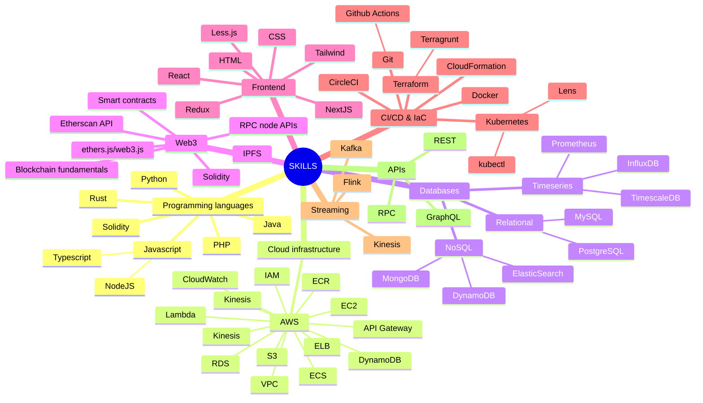

---
# the default layout is 'page'
icon: fas fa-info-circle
order: 4
mermaid: true
---

Hey, I'm Toomas 👋  

I love building cool stuff. Since the physical world can be limiting, I prefer to use a keyboard instead of hammer and nails (although sometimes you do need to touch grass as well). I created this site to document any interesting problems I come across while building. Mainly for processing and solidifying them in my mind. But if anyone else finds them helpful, that's great. I have had the idea to do this for a long time and just now got around to it, so I have a lot of catch-up to do... or I'll just write them as they come, let's see.

--- 

I have over 8 years of software engineering experience, during which I've worked on dev tooling, NFT projects, payment systems, e-commerce sites and much more. But I am always hungry to do more. I have outlined my experience on this page into sections: [my work experience](#work-experience), [my side projects](#projects), [hackaton projects](#hackatons), [education](#education) and [skills](#skills).  

> If you prefer a more old-school resume, [I've got you covered](){:target="_blank"}
{: .prompt-tip }

## Work Experience

{: .left w="150" h="150" }  
#### [Blocktorch](https://www.blocktorch.xyz/){:target="_blank"}  
_March 2023 - Present_  

Senior Software Engineer

 

**Responsibilities**
- Building scalable backend infrastructure and services for a cross-blockchain monitoring solution. That includes data ingestion from various blockchains; data processing to extract logs, metrics, and traces; alerting and monitoring etc.
- Taking ownership of new features from design to implementation.
- Creating and managing cloud infrastructure running on Kubernetes.
- Focusing on code quality and efficient development processes.
- Learning about the Web3 ecosystem and trying to identify solvable problems for the developers in this space.

**Key achievements**
- Transaction explorer - built a public feature of Blocktorch, similar to Etherscan, but better. It was featured in an [Alchemy course](https://youtu.be/OglzIgPD-Zw?t=2520){:target="_blank"} focused on Account Abstraction.
- Built a transaction debugger and simulator for any chain with an RPC connection.
- Built a custom project-based authentication flow using Supabase Auth. It also included a system of API keys.
- Designed and implemented a metrics pipeline using TimescaleDB. Everything from reading the blockchain data, extracting and saving metrics from it, and reading it in the UI.
- Developed a feature with an SDK to catch and analyze client-side errors when interacting with the blockchain.
- Created and enforced code style rules and best practices with the team to improve our workflow.
- As an engineer in a very early-stage start-up, I learned to be extra fast, cut necessary corners, and be efficient in testing new ideas. 

 

{: .left w="150" h="150" }  
#### [Dashbird](https://dashbird.io/){:target="_blank"}  
_February 2020 - March 2023_  

Full Stack Software Engineer

 

**Responsibilites**
- Building scalable and reliable backend microservices for all parts of the product. Everything from account management to high volume log ingestion, monitoring for the customers' AWS infrastructure, and analytics. Microservices were mainly written in NodeJS / Typescript.
- Often leading features from start to finish. This includes research, planning, development, and deployment.
- Developing the React front-end application.
- Creating and maintaining cloud infrastructure using IaC tools like Terraform (Terragrunt) and CloudFormation
- Enforcing good development practices in the engineering team. E.g high test coverage, code reviews, better bug monitoring, Scrum implementation. 
- Working with the team to analyze our work processes and improve them constantly.

**Key achievements**
- Built the company's billing system and Stripe integration from the ground up.
- Lead several new features, e.g. logs search, AppSync logs ingestion, automated infrastructure insights etc.
- Built an admin panel for internal use.
- Many high-impact code and infrastructure improvements. For example, reduced our Lambda costs by up to 30% by removing redundant executions. In another case, took the initiative to reduce a microservice's error rate by more than 1000%.
- Implemented [Shape Up](https://basecamp.com/shapeup){:target="_blank"} working methodology by Basecamp
- Completed an AWS certification and learned to use a large number of AWS services.
- Improved my teamwork skills and my ability to write code that is reliable and scalable.

 

{: .left w="150" h="150" }   
#### [Lumav Commerce](https://www.lumav.com/){:target="_blank"}  
_February 2016 - February 2020_  

Software Developer  

 

**Responsibilities**
- Building e-commerce sites and Magento extensions in PHP / JavaScript
- Integrating various 3rd party APIs (warehouse management systems, payment and shipping processors)
- Working closely with project managers to oversee the technical aspects of the projects  

**Key achievements**
- I developed the [Pakendikeskus](https://www.pakendikeskus.ee/){:target="_blank"} website, which won the award for the most user-friendly website in the Baltics
- Passed the Magento 2 Certified Professional Developer exam and was one of the first developers in Estonia to do so.

 

## Projects

##### [MurAll](https://murall.art/){:target="_blank"}  
_December 2019 - Present_  

{: .left w="150" h="150" } I co-founded [MurAll](https://murall.art/){:target="_blank"}, a digital collaborative canvas living on the Ethereum blockchain.  
The main idea is that you use $PAINT tokens to contribute on a public wall, after which the tokens are burned and you get an NFT of your contribution. Since the image data is stored on-chain, it is immutable, censorship-resitant and always available.  

This was the initial idea and product, but it has become much-much more with 3 separate walls on different chains, supporting image & video, introduction of a DAO, combining MurAll NFTs into one NFT, etc. I won't go into all the details here, you can learn all about it on the [website](https://murall.art/){:target="_blank"}.

In the beginning of the project, I also worked on the smart contracts, but my main tasks were building the backend infrastructure and also the website. The backend is built on AWS serverless infrastructure using Lambdas, DynamoDB, API Gateways and S3. The frontend is a React application with the canvas as a standalone JS project.  

In addition to technical work, I also had to do a lot of business development, community management and marketing. All in all, this project has taught me a lot about building a business and the crypto space. 

---

##### [Frames](https://frames.murall.art/){:target="_blank"}  
_October 2021 - Present_  

{: .left w="150" h="150" } [Frames](https://frames.murall.art/){:target="_blank"} is a really unique side-project with the MurAll team that I am really proud of. Created in the midst of the 2021 NFT bull run with PFPs and copy-cat projects pumping, this was something different and exciting.  

A **FRAME** is a dynamic NFT that you can wrap around your other existing NFTs. It will change size based on the dimensions of the NFT you combine it with and will wrap around it, enhancing its look. It even works cross-chain!

I mainly took care of the backend infrastructure and website. Similarly to MurAll, the backend is built on AWS serverless infrastructure and the website is a React application.

---

##### Telia's Marketing Campaign
_July 2017 - October 2017_  

{: .left w="150" h="150" } As a freelancer I developed a website and the infrastructure for a marketing campaign. Users could add their contact information in order to take part in a prize draw.  
This was my first stand-alone project and was a good learning experience on how to build and host a website and a database, how to protect user data and build automated emails.  

---

##### [Tallinn's Old Town Society](https://vanalinnaselts.ee/){:target="_blank"}
_January 2016 - August 2018_  

{: .left w="150" h="150" }  
I built and maintained [homepage for Tallinn's Old Town Society](https://vanalinnaselts.ee/){:target="_blank"} using Wordpress.  

 

## Hackatons

##### EthGlobal Istanbul 2023
[Nazar](https://ethglobal.com/showcase/nazar-fs9ov){:target="_blank"} was my most successful hackaton project yet! A visual Account Abstraction explorer with on-chain notifications for similar transactions.

---

##### EthGlobal Paris 2023
[Voulez-Vous Authenticate](https://ethglobal.com/showcase/voulez-vous-authenticate-ik3ad){:target="_blank"} is a SSO solution for web3 wallets using Account Abstraction and zkProofs. It was a tough hack with almost no sleep for the whole weekend.

---

##### EthGlobal Lisbon 2023
One of my first hackatons with the Blocktorch team. We built an automatic discovery service and on-chain registry for optimistic rollups called [Opti-mystic](https://ethglobal.com/showcase/opti-mystic-ze5mb){:target="_blank"}! 

 

## Education
#### Certificates

---

**[AWS Certified Solutions Architect – Associate](https://www.credly.com/badges/7e94ba90-6c39-4442-ae10-f6c7e7779765/public_url){:target="_blank"}**  
Amazon Web Services Training and Certification  
Issued May 2020

---

**[Magento 2 Certified Professional Developer](https://u.magento.com/certification/directory/dev/3204760/){:target="_blank"}**  
Adobe Commerce  
Issued Aug 2018  
Credential ID 5985851  

#### University

---

**Computer Security and Resilience MSc, Newcastle University**  
_2018 September - 2019 September_  

Graduated with a distinction.  
Dissertation topic - EVM Smart Contract Vulnerabilities

---

**Informatics B.S.E, Tallinn University of Technology**  
_2014 September - 2017 June_

 

## Skills

Instead of a boring list, I decided to a use a mind map. Looks better, right?

